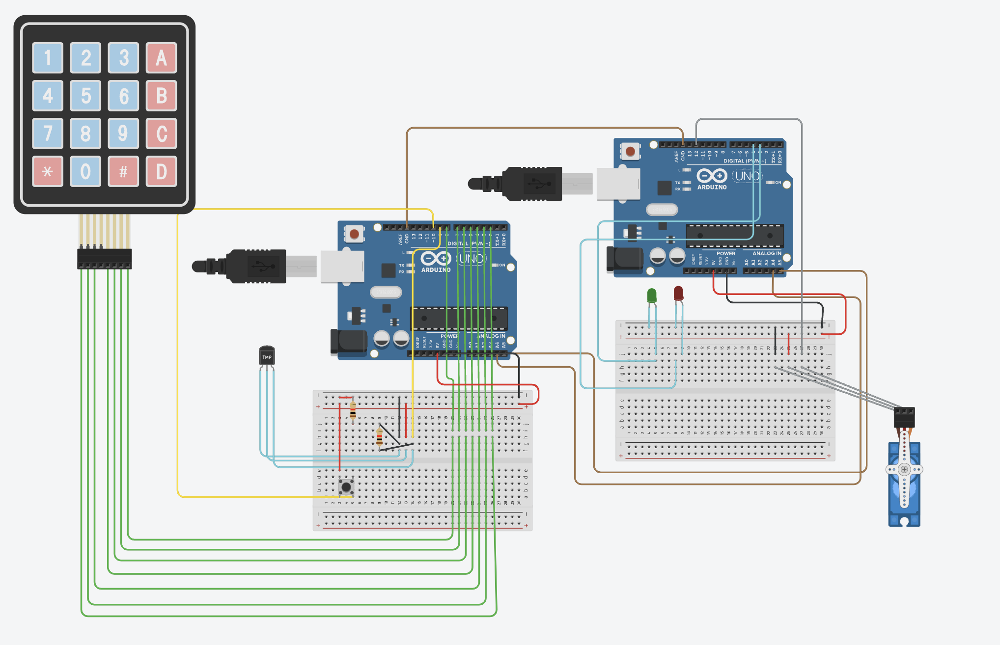

# Home-Monitoring-system

This project implements a basic home security system using two Arduino Unos connected via I2C. The system uses hall effect sensors to detect door/window breaches and includes a keypad-based interface to arm or disarm the alarm.

## Features

**Master Arduino**:
  - Controls system state (armed/disarmed)
  - Receives data from the Slave over I2C
  - Displays status via LEDs
  - Uses a keypad for user input

**Slave Arduino**:
  - Continuously monitors hall effect sensors
  - Sends breach status to the Master over I2C

##  Hardware Used

2 × Arduino Uno
2 × Hall Effect Sensors (for breach detection)
1 × Keypad (4x4 or 3x4)
1 × Red LED (breach alert)
1 × Green LED (system armed/normal status)
Jumper wires, breadboards
Pull-up resistors (for I2C lines if needed)

##  Wiring Overview

**I2C Connection**:
  - SDA: A4 (both Arduinos)
  - SCL: A5 (both Arduinos)
  - Connect GNDs and 5V between boards
**Sensors connected to Slave**
**Keypad and LEDs connected to Master**

##  Files Included

master_arduino.ino: Code for the Master Arduino (dashboard, input, LED control)
slave_arduino.ino: Code for the Slave Arduino (sensors and communication)
tinkercad_link.txt: Link to the Tinkercad simulation
(Optional) /images: Folder with circuit screenshots or diagrams

##  How It Works

1. The Master starts in a neutral state. User can arm the system via the keypad.
2. The Slave monitors magnetic contacts (hall sensors).
3. If a breach is detected and the system is armed, the Master activates the red LED.
4. The system can be disarmed via the keypad, returning to a safe state.
ad:  

## Circuit Diagram

